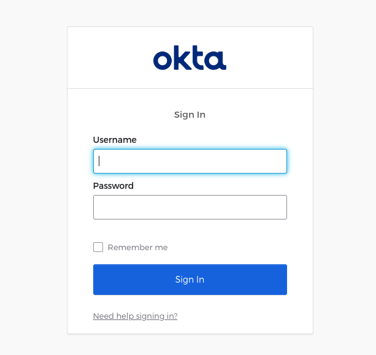

# OIDC Examples
Working examples of OpenID Connect integrations in BlackSheep applications.

:warning: these examples work with BlackSheep v2. Browse the repository
at [tag `v1`](https://github.com/Neoteroi/BlackSheep-Examples/tree/v1) to see
examples for `blacksheep` v1.

---

This repository contains examples of OpenID Connect integration with three
identity providers:

- [Auth0](https://auth0.com)
- [Azure Active Directory](https://azure.microsoft.com/en-us/products/active-directory)
- [Google](https://developers.google.com/identity/sign-in/web/sign-in)
- [Okta](https://www.okta.com)

And illustrate the following scenarios:
- exchanging `id_token` with clients using response cookies, users are
  authenticated in following requests using those cookies, this is the default
  configuration.
- exchanging tokens with clients using the HTML5 Storage API, users are later
  authenticated using JWT Bearer tokens (see examples with 'storage' in
  their file names).
- using a [Redis](https://github.com/redis/redis-py) cache to store access
  tokens and refresh tokens, when id_tokens are exchanged with clients using
  cookies (see the example with "redis" in the file name.

## Basic examples (id_token only)

The files whose names start with "basic_" are configured to obtain only
an `id_token`. This is useful when the same application that integrates with
OpenID Connect does not need an access token for another API and all it needs
is to _identify_ users. The values in these files describe real applications
configured in tenants owned by the owner of this repository.

App registrations for these examples only need to be configured with authentication
URL `http://localhost:5000/authorization-callback` and enable issuing `id_token`s.

## Running the examples

1. create a Python virtual environment, and activate it
2. install dependencies `pip install -r requirements.txt`
3. run one of the basic examples `python basic_auth0.py`
4. navigate to [http://localhost:5000](http://localhost:5000)
5. click on the sign-in link, follow the instructions to sign-up / sign-in

:warning: these examples only work with `localhost`!!!

### Azure Active Directory

This example can be tested using any Microsoft account, signing-in in the
demo app inside the Azure tenant Neoteroi.

After sign-in, the application shows user claims.

### Auth0

This example can be tested by anyone, since the application in Auth0 enable
creating an account in the Neoteroi account in Auth0.

### Google

This example can be tested by anyone having a Google account.
**Note:** it has been tested and it works also with `BlackSheep` v1.

### Okta

This example illustrates navigating to a sign-in page, but cannot be tested
fully because the Okta account is not configured to enable sign-up.

## Examples with scopes (id_token and access_token)

The files whose names start with "scopes_" are configured to obtain, together
with an `id_token`, an `access_token` for an API. These require secrets which,
of course, are not exposed in this repository.

App registrations for these examples are slightly more complex, since they
require configuring an API with scopes. Describing these details is beyond the
scope of this repository. For more information on this subject, refer to the
documentation of the identity providers (for example, for [Auth0 here](https://auth0.com/docs/get-started/apis/api-settings))

## Examples using the HTML5 Storage API instead of cookies

See the examples with 'storage' in their file names, to see how tokens can be
exchanged with the clients using the HTML5 Storage API instead of response
cookies (useful to improve reusability of web APIs).
